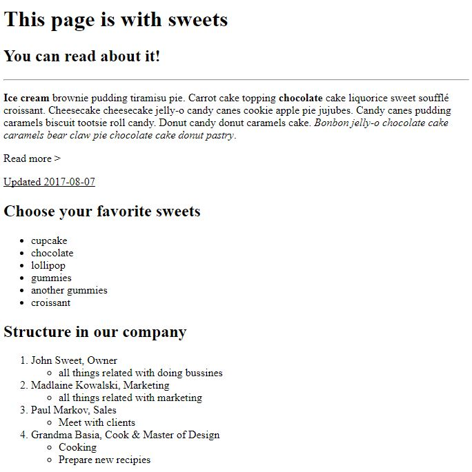

# HTML &ndash; formatowanie tekstu

Na podstawie znanych elementów HTML spróbuj stworzyć identyczną strukturę w **index.html**.

 

 ## Ważne
 W pierwszym akapicie nie nadużywaj znacznika przełamania linii **br**. Zauważ, że w edytorze Word nie wstawiasz znaku enter na końcu każdego wiersza. W kodzie html też pozwól na swobodne przelewanie się tekstu w ramach paragrafu (akapitu).

&#8222;Read more &gt;&#8221; powinno zaczynać się od nowego paragrafu, a znak &gt; powinien być w unicode.

 Nie zwracaj uwagi na typ znacznika w liście zagnieżdżonej. Nie jest istotne, czy poszczególne elementy zaczynają się od symbolu koła, okrągu czy kwadratu. Ważne, aby to była lista nieuporządkowana (**ul**).