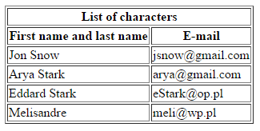

# HTML &ndash; tabele

1. Stwórz w pliku **index.html** następującą tabelę.

   

1. Stwórz w pliku **index.html** następującą tabelę.

   

## Ważne

* W pliku CSS jest przygotowany styl, dzięki czemu tabele będą miały odpowiednie obramowanie. Trzeba tylko &ndash; jak w innych zadaniach &ndash; podłączyć plik ze stylami.
* W obu tabelach pamiętaj o atrybucie **scope**.
* Nie stosuj znaczników formatujących tekst takich jak **b** czy **strong**.
* Pamiętaj nie tylko o nagłówkach poziomych, lecz także &ndash; pionowych.