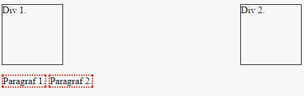

# HTML/CSS &ndash; elementy obok siebie

Ustaw elementy według poniższego wzoru.

##### 1. W pierwszym wierszu mają być dwa elementy **div** o następujących własnościach:
  * szerokość elementu: 100px,
  * wysokość elementu: 100px,
  * szerokość obramowania: 1px,
  * styl obramowania: pojedyncza linia ciągła (**solid**),
  * kolor obramowania: czarny.

  Pierwszy div ma znajdować się po lewej stronie, a drugi &ndash; po prawej.
Między nimi nie może być żadnych elementów.

##### 2. W drugim wierszu mają się znaleźć dwa paragrafy o następujących własnościach:
  * szerokość elementu: 80px,
  * szerokość obramowania: 2px,
  * styl obramowania: pojedyncza linia kropkowana (**dotted**),
  * kolor obramowania: czerwony.

  Paragrafy maja ustawiać się obok siebie, po lewej stronie.

---

## Ważne
Do odpowiedniego ustawienia elementów możesz korzystać wyłącznie z następujących własności:
  * **display**
  * **float**
  * **clear**

Nie musisz jednak korzystać ze wszystkich wyżej wymienionych.

Aby ustawić elementy obok siebie skorzystaj albo z **float** albo z **display**. W tym przypadku nie może być w jednym elemencie obu tych własności na raz.
