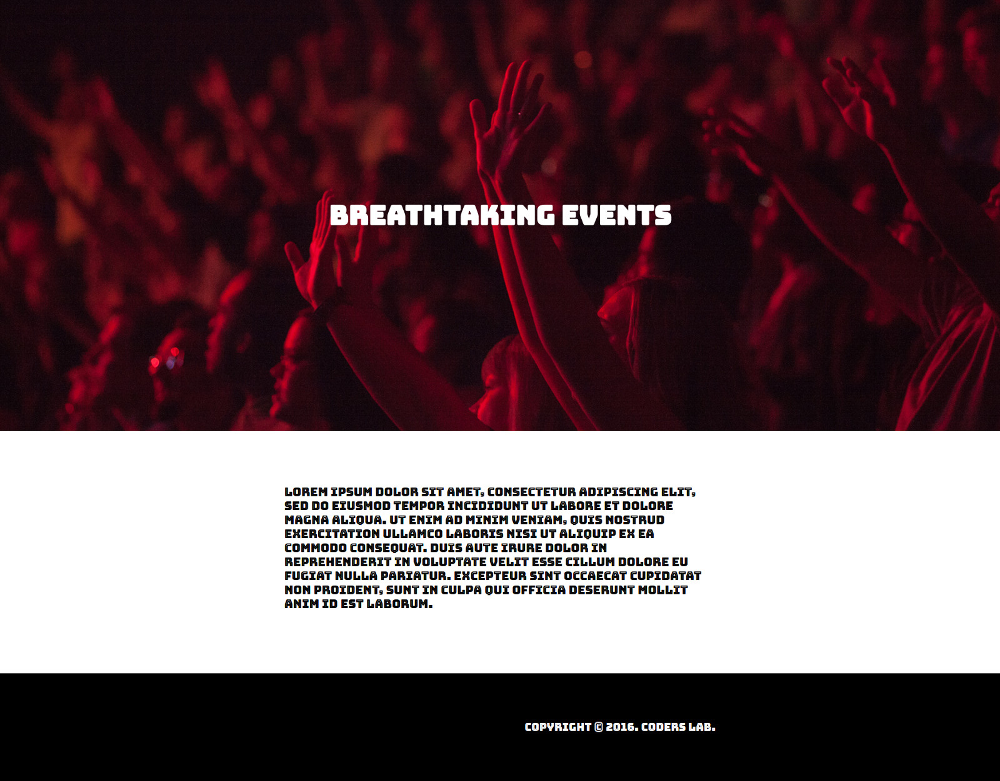

# Zaawansowany HTML i CSS - zadania domowe

> Kod wpisz w odpowiednim pliku, zgodnie z poleceniem zadania. BARDZO WAŻNE - Wasze zadania są sprawdzane przy pomocy automatycznego systemu. Żeby odpowiedzi zostały uznane za poprawne, wszystkie rozwiązane zadania muszą wyświetlać dokładnie to, co jest podane w treści zadania!

## Dzień 3

### Ćwiczenie 1. Prosta strona

Stwórz stronę jak na załączonym obrazku:



* Zacznij od zresetowania wszystkich właściwości CSS zależnych od przeglądarki (prosty reset wystarczy).
* Dołącz do strony font [Bungee Inline](https://fonts.google.com/specimen/Bungee+Inline). Podłącz rodzinę czcionek bezpośrednio z Google Fonts.
* Do body dodaj 3 elementy:
    * ```header```
    * ```section```
    * ```footer```
* Stwórz klasę __container__. Ustaw jej szerokość ```800px``` i spraw, żeby zawsze była wyśrodkowana w poziomie.
* Ustaw elementowi ```header``` szerokość ```100%``` oraz wysokość ```700px``` i użyj pliku __concert.jpg__ z katalogu __images__ jako tła.
* Niech tło w elemencie ```header``` zawsze będzie wyśrodkowane i zawsze odpowiednio rozciągnięte aby pokryć cały element (użyj odpowiednich wartości przy właściwościach ```background-size``` i ```background-position```).
* Wewnątrz elementu ```header``` umieść tekst (wykorzystaj odpowiedni semantyczny element), wyśrodkuj go w pionie i poziomie względem rodzica i nadaj mu odpowiednie właściwości:
    * waga czcionki na ```700```,
    * wielkość czcionki na ```50px```,
    * kolor ustaw na ```#FFFFFF```
* Ustaw elementowi ```section``` szerokość ```100%``` oraz wysokość ```350px``` i kolor tła ```#FFFFFF```.
* W pliku __text.txt__ w katalogu __Dzien_3__ jest tekst, jaki należy umieścić wewnątrz elementu ```section```.
* Pamiętaj, że tekst w elemencie ```section``` musi zostać ograniczony przez odpowiedni element z klasą __containter__.
* Odsuń tekst od góry o ```100px``` i nadaj mu odpowiednie właściwości:
    * waga czcionki ```400```,
    * wielkość czcionki ```22px```,
    * wysokość linii ```26px```
* Ustaw elementowi ```footer``` szerokość ```100%``` i wysokość ```200px``` oraz kolor tła ```#000000```.
* Tekst w elemencie ```footer``` jest wyśrodkowany w pionie i przesunięty maksymalnie w prawo (pamiętaj, że jest ogarniczony przez elemenet z klasą __container__).
* Tekst w elemencie ```footer``` ma następujące właściwości:
    * waga czcionki ```400```,
    * wielkość czcionki ```20px```,
    * kolor czcionki ```#FFFFFF```.
